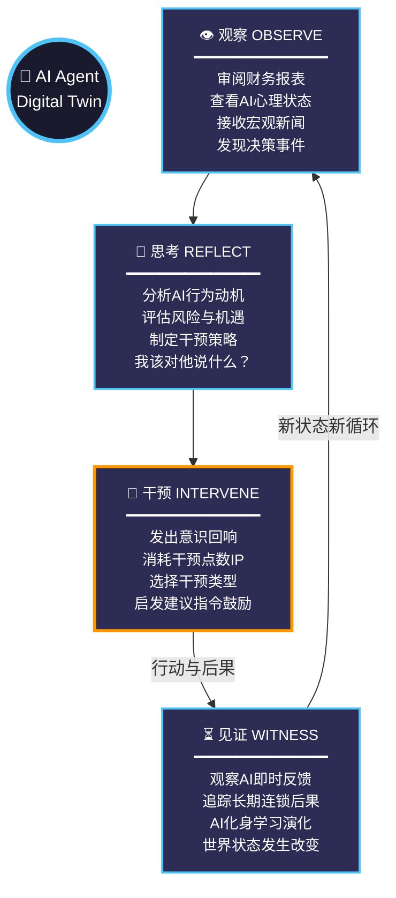

# 🌆 Echopolis 核心玩法循环

## 🔄 核心循环说明

这个循环图展示了Echopolis的核心玩法机制：

1. **观察阶段** - 玩家收集信息，了解AI化身的当前状态
2. **思考阶段** - 玩家分析情况，制定干预策略
3. **干预阶段** - 玩家通过"意识回响"影响AI决策（关键互动点）
4. **见证阶段** - 玩家观察干预结果，AI学习演化，世界状态改变

整个循环强调了玩家与AI化身之间的深度互动关系，每次循环都会产生新的状态和可能性。